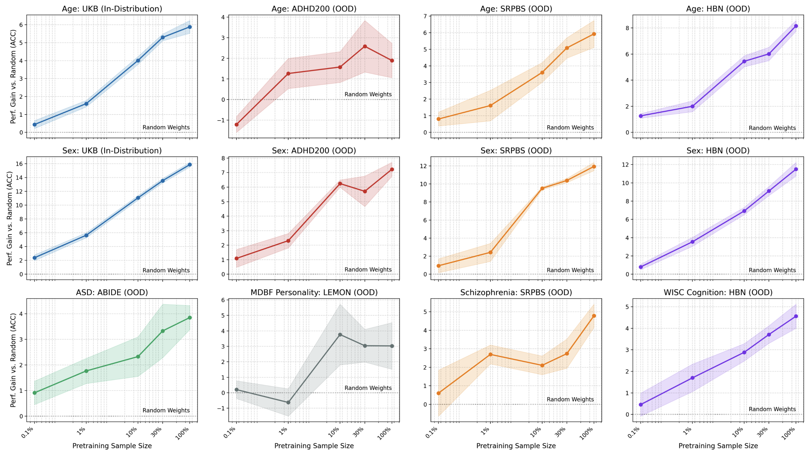

# Brain-Semantoks: Learning Semantic Tokens of Brain Dynamics with a Self-Distilled Foundation Model

**Authors**: Sam Gijsen, Marc-Andre Schulz, Kerstin Ritter

Brain-Semantoks is an fMRI Transformer foundation model which can be used to extract high-level representations of fMRI recordings or finetuned for downstream tasks.

- Pretrained for abstract representations which are stable across time.
- Uses a network-based tokenizer, which improves performance and makes the model very efficient. For probing, a CPU suffices.
- We stabilize DINO-style pretraining using a principled but simple regularizer.
- Performs well on downstream tasks using just a linear probe, avoiding the necessity for extensive finetuning.

<p align="center">
  
  
</p>

<p align="center">
  <em>Left: The tokenizer generates network tokens from brain regions. Right: We observe strong dowsntream scaling performance as a function of pretraining dataset size using a linear probe only.</em>
</p>

## Download Pretrained Model

The pretrained model is available on HuggingFace:

```bash
https://huggingface.co/SamGijsen/Brain-Semantoks
```

## Dataset Requirements

### Preprocessing

The model operates on parcellated 3T fMRI timeseries. 

- **Parcellation**: We use Schaefer-400 (Cortex), Tian-3 (Subcortical), and Buckner-7 (Cerebellum). If you're missing the subcortical and/or cerebellar parcellation, you can still run the model by masking their tokens (post-tokenizer).
- **TR**: 2.0 seconds (0.5 Hz sampling rate)
- **Bandpass filtering**: 0.01-0.1 Hz (similar ranges like 0.009-0.08 Hz also work and preliminary tests show the model still performs well for unfiltered data)
- **Normalization**: Z-scoring per ROI per subject

### ROI Ordering 

The model expects ROIs in **7-network ordering** for Schaefer parcellations. This differs from some other models which use 17-network ordering. (The ROIs are the same between 7n and 17n versions, but they're ordered differently!)

See: [Schaefer2018 Parcellations (Yeo Lab)](https://github.com/ThomasYeoLab/CBIG/tree/v0.14.3-Update_Yeo2011_Schaefer2018_labelname/stable_projects/brain_parcellation/Schaefer2018_LocalGlobal/Parcellations/MNI/)

### HDF5 File Structure

```
dataset.h5
├── timeseries/
│   ├── schaefer400    # (n_subjects, 400, n_timepoints)  
│   ├── tian3          # (n_subjects, 50, n_timepoints)
│   └── buckner7       # (n_subjects, 7, n_timepoints)
├── long_subject_id    # Subject identifiers
├── age_5c             # Labels for downstream tasks (optional)
└── sex_bi             # Labels for downstream tasks (optional)
```

See `example.ipynb` for a complete example of creating a synthetic dataset with proper preprocessing. (The time dimension can be padded with nans at the end to ensure all subjects have identical timeseries lengths).

## Network Mapping

The model groups ROIs into functional networks using a mapping file (`network_mapping.npz`).

```python
import numpy as np
data = np.load('network_mapping.npz')

# Keys:
# - network_map_schaefer400_7n:  (400,) -> 7 networks
# - network_map_tian3:           (50,)  -> 1 network (subcortical)
# - network_map_buckner7:        (7,)   -> 1 network (cerebellar)
```

Config usage:
```yaml
data:
  network_map_path: ./network_mapping.npz
  schaefer_atlas: schaefer400
  schaefer_networks: 7  # Uses key: network_map_schaefer400_7n
```

## Installation

```bash
# Create environment
mamba create -n brainsemantoks python=3.12 -y
mamba activate brainsemantoks

# Install PyTorch (CUDA 12.1)
pip install torch torchvision --index-url https://download.pytorch.org/whl/cu121

# Install dependencies
pip install -r requirements.txt

# Optional: Flash attention for faster training
pip install flash-attn --no-build-isolation
```

## Usage

`main.py --config path/to/cfg.py` 

In the config file, you can specify when you want to perform linear probing or finetune evaluation. If you want to evaluate a pretrained model, you can set as below, which will skip pretraining.

```python
training:
  epochs: 0 # no pretraining will be performed
  resume_checkpoint: /path/to/pretrained/model.pth # checkpoint file to load
linear_probe:
  probe_at_epochs: [0] # perform linear probing prior to any training

# alternatives:
# probe_at_epochs: [] # no probe evaluation
# probe_at_epochs: [10, 100] # will probe after 10 and 100 epochs
```
